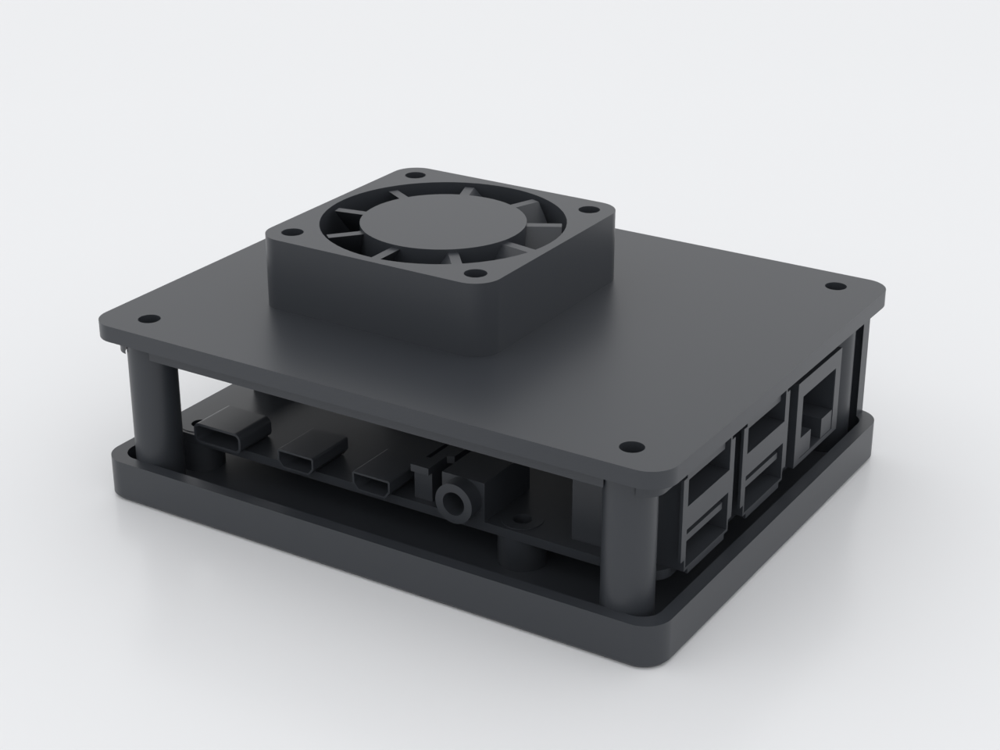
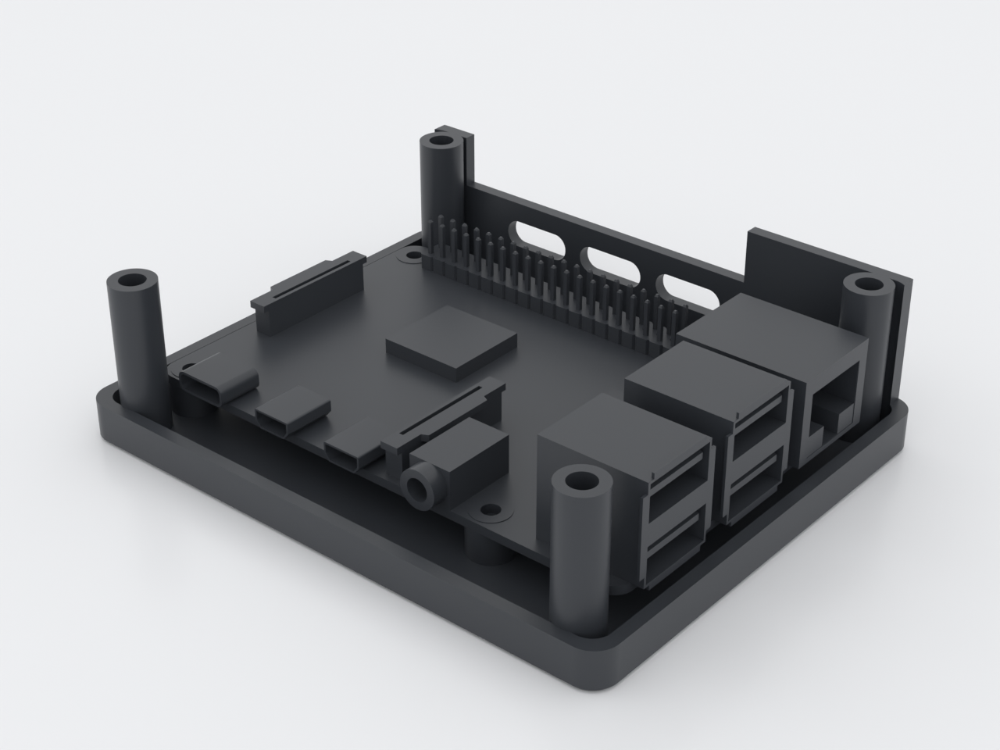
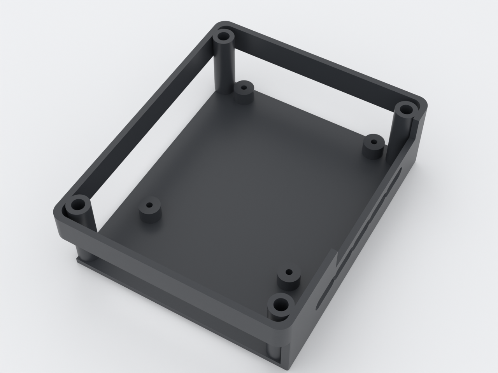
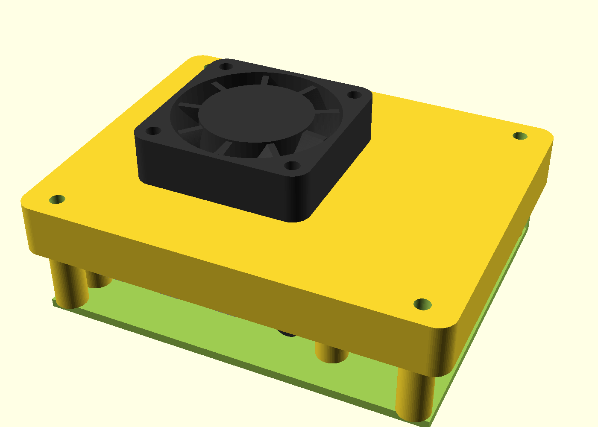
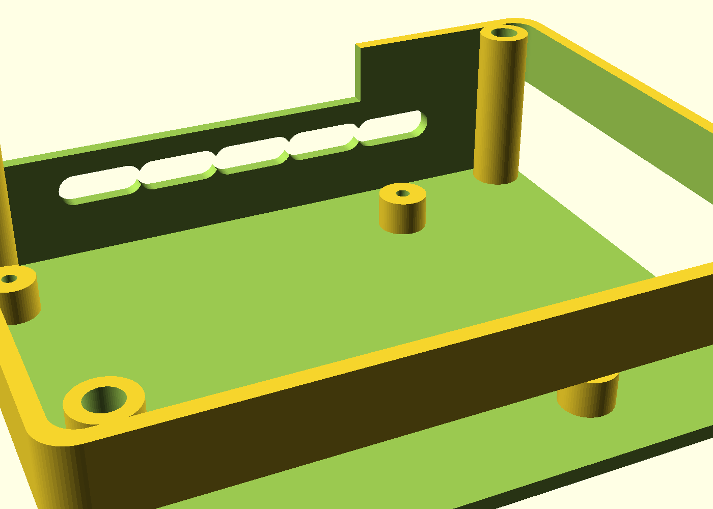
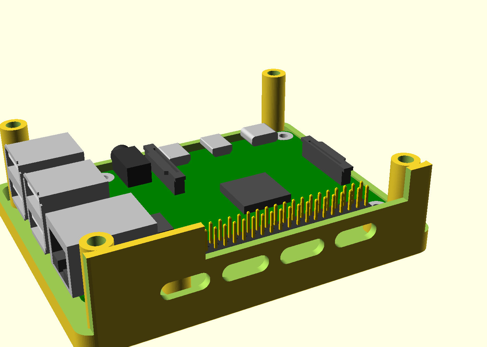

# sbc-case — vented Raspberry Pi 4 case with fan mount

A two-piece FDM case for the Raspberry Pi 4 (and other NopSCADlib-catalogued
SBCs) with a 40 mm intake fan, heat-set inserts at every repeated-assembly
point, and cable access through open skirted edges — no connectors ever fight
a tight hole. The standoff pattern is generated from the board's own mounting
hole list at build time, so pointing `board` at another PCB re-places the
standoffs automatically.

*The Raspberry Pi 4 and 40 mm fan are shown for fit — both are purchased
separately (see the bill of materials below).*

## What you get

- `base` — the tray: floor, skirted cable edges, four board standoffs (generated
  from `pcb_screw_positions`), four through-bored lid-screw posts
  (~95 × 76 × 26 mm)
- `lid` — the flat top: register lip (notched around the lid-screw posts),
  Ø37 fan aperture, four insert bosses on the inner face, lid-screw holes
  (~95 × 76 × 2.5 mm plate + 7 mm bosses)
- `sbc-case-coupon` — two crops of the same case corner that nest; print it
  first to tune the fits (~14 × 76 × 26 mm)

Plus the hardware on the bill of materials (see
[ASSEMBLY.md](ASSEMBLY.md)): 8 × M3 heat-set inserts, 4 × M2.5 screws, 4 × M3
cap screws, 4 × M3 × 20 dome screws + washers, one 40 mm 5 V fan. Every screw
comes out of one standard **M2.5 / M3 assortment** plus that single fan — not
five separate hardware orders.

## Print settings

- **Material:** PETG or ASA
- **Layer height:** 0.2 mm
- **Infill:** 15 %, gyroid
- **Supports:** none needed — both parts are support-free by design
- **Orientation:** `base` floor-down as modeled; `lid` outer-face-down (the
  rendered `part="lid"` orientation) — the register lip and fan bosses print
  as standing features. **Print the coupon first** (with a brim) — see below.
- **Seam:** set it to **Back** (or a scarf seam). The stock *Aligned* seam
  stacks a vertical ridge on the base's show walls, and one stack lands inside
  the cavity right where the lid lip registers.
- **Plate (PETG):** print PETG on a **textured** sheet — it welds to smooth PEI.
- **Enclosure (ASA):** ASA wants an **enclosure** — the flat 94.5 × 76.2 mm lid
  and the long open skirt edges lift on a cold chamber. No enclosure → use PETG.
- **Lid first layer:** enable **elephant-foot compensation** for the `lid`. It
  prints outer-face-down, so its show face *is* the bed face (the `base` already
  carries a 0.6 mm bed chamfer; the lid plate does not).
- **Feet:** stick four **adhesive rubber feet** on the floor — the case sits on
  a flat base, and feet keep it from walking when you plug a cable in one-handed.

The as-printed pose — iso, top, front and bottom-iso of the sliced parts:

## Parameters

| Parameter | Default | What it does |
|---|---|---|
| `board` | `RPI4` | NopSCADlib board type — standoffs follow its hole list |
| `fit_clearance` | 0.25 mm | lid register lip vs cavity wall; tune on the coupon |
| `standoff_h` | 5 mm | board standoff height (4–6 per the brief) |
| `interior_h` | 24 mm | interior height; sized over the tallest RPI4 connector |
| `fan_type` | `fan40x11` | fan vitamin; aperture and boss pitch follow it |
| `fan_center` | (−10, 0) mm | fan position; biased toward the SoC |
| `board_clr` | 0.75 mm | board-to-wall clearance |
| `wall` / `floor_t` / `lid_t` | 2.0 / 2.0 / 2.5 mm | shell thicknesses |

All parameters are at the top of `sbc-case.scad` in Customizer sections;
override on the command line with `-D 'fit_clearance=0.3'`.

## Assembly & use

Full bill of materials and step-by-step instructions: [ASSEMBLY.md](ASSEMBLY.md)
and the exploded view below. The short version: melt the inserts in, drop the
board on (it self-locates on the standoffs), screw it down, seat the lid, bolt
the fan on blowing into the case.

If a fit is off, tune it on the coupon (NOTES.md, "Print this first") and
reprint only the affected part — the coupon is cropped from the same geometry,
so what you feel there is what the full parts do.

## Living with it

- **Swap the micro-SD without opening the case.** The −X edge is open, so the
  card — and every cable — comes out with the lid on and every screw untouched.
  The 2 a.m. reflash needs no tools.
- **GPIO stays reachable.** A notch in the +Y wall clears the 2×20 header, so
  jumper wires reach the pins with the lid on.
- **Serviceable where it counts.** The heat-set inserts sit at the two joints
  you ever revisit — the lid and the fan — so opening the case or swapping the
  fan (a sleeve-bearing 40 mm fan is a 4–6 year part) never chews a plastic
  thread. The board screws are the ones you touch once.
- **Keep it breathing.** The fan blows *in* through an open-skirted case, so
  it is an intake for dust too — on an always-on build, blow the fan and the
  vent row out every few months.

## Licensing

This design incorporates parts of [NopSCADlib](../../lib/NopSCADlib/VENDORED.md), which is
licensed under **GPL-3.0**: the board, fan, insert and screw definitions it
reads at build time and renders in its assembly documentation. The exported
case geometry is therefore a GPL-3.0 combined work — you may print and share
it freely under those terms, keeping the license and attribution intact. This
isolation is deliberate (see [docs/licensing.md](../../docs/licensing.md)): designs
that do not use NopSCADlib in this repo are unaffected.
