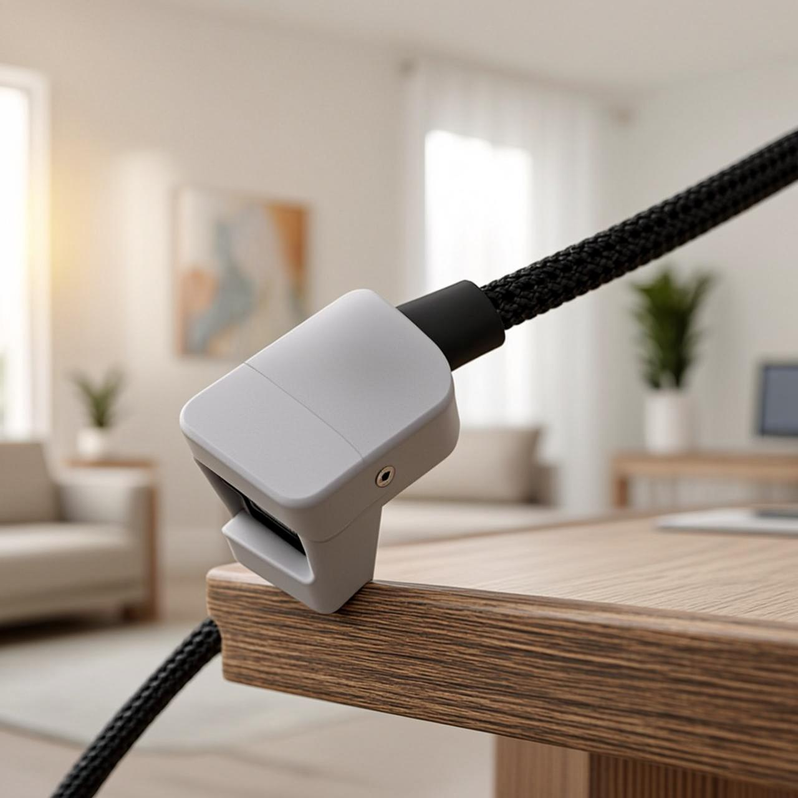

# snap-cantilever-clip

A screw-down cable clip whose two retaining lips are **cantilever flexures**:
push a ~6 mm cable into the mouth, the lips spread over the snap interference,
the cable seats, and the lips spring back to hold it. The simplest compliant
mechanism — a snap — done right (`docs/advanced-techniques.md`, Domain 1).

*AI-generated impression for general illustration only — geometry is approximate and may not exactly match the printed part; see the studio render above and the STL for the true shape.*

## What you get

- `snap-cantilever-clip` — one part, ≈ 27 × 11 × 10 mm, with a mounting hole.

## Print settings

- **Material:** PETG or PP preferred (they flex for many cycles); PLA works for
  light use but is brittle at the flexing lips
- **Layer height:** 0.2 mm
- **Infill:** 40 %+ (thin part — perimeters do most of the work)
- **Supports:** none needed
- **Orientation:** **flat, as modelled** — this is load-bearing. The silhouette
  is in the bed plane, so the lips flex *within* a layer. Print it upright and a
  lip delaminates on the first cable.

## Parameters

| Parameter | Default | What it does |
|---|---|---|
| `cable_d` | 6 mm | nominal cable/rod diameter to hold |
| `grip` | 1.0 mm | how much narrower the mouth is than the cable (retention vs insertion force) |
| `wall` | 2.4 mm | lip/flexure thickness |
| `root_fillet` | 1.4 mm | fillet at the flexure root — must be ≥ 0.5·`wall` (guarded) |
| `width` | 10 mm | clip width along the cable |

All parameters are at the top of `snap-cantilever-clip.scad`; override with
`-D 'cable_d=8'`.
