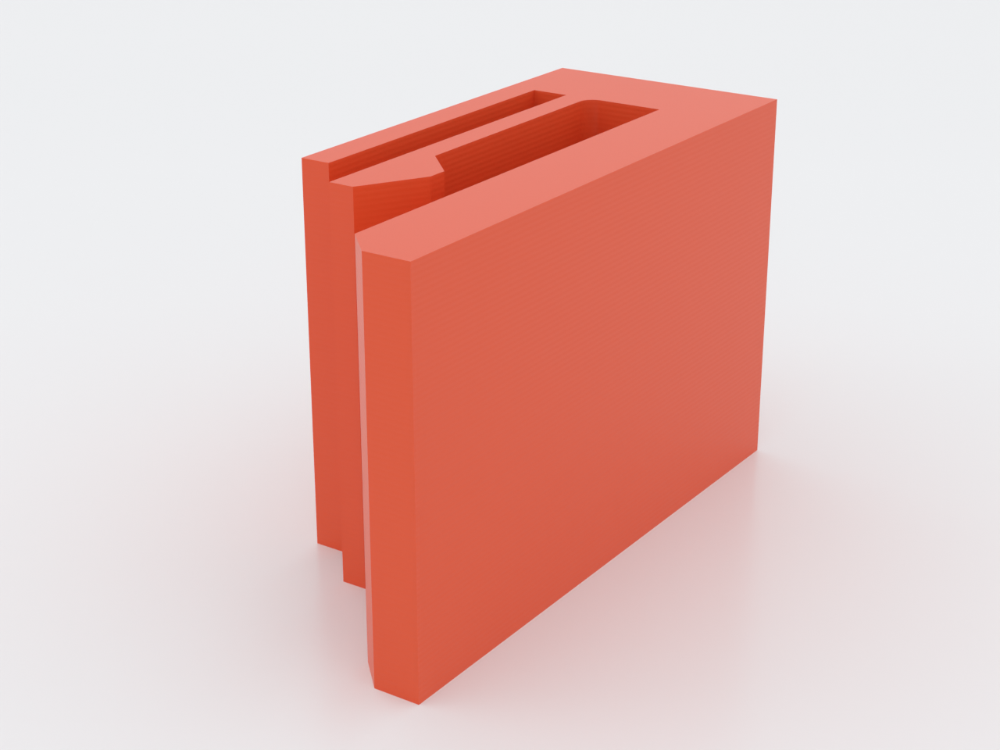
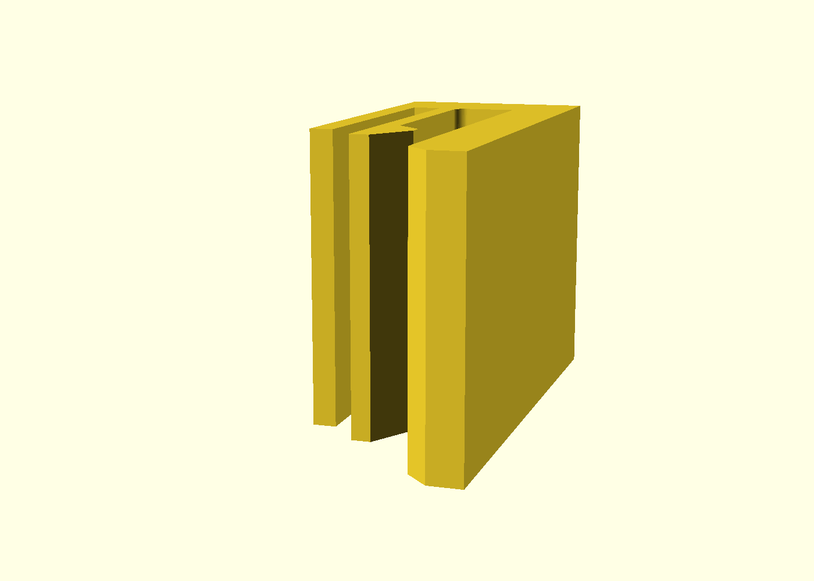

# snap-cantilever-clip

A one-piece clip that snaps onto the edge of a 3 mm plate — shelf stock,
acrylic, MDF, cardboard — and holds by **cantilever deflection**: the
canonical snap-fit, built as the reference design for the repo's compliant-
mechanics catalog (`docs/advanced-techniques.md`, Domain 1). Push it on, a
finger cams open over the plate, springs back behind it, and the clip grips
by spring preload; pulling it off takes about twice the force, via the steep
retention shoulder. Every dimension comes from the small-length-flexural-
pivot relations — not guessed: stiffness `K = E·I/L`, insertion force
`F = 3EIδ/L³` ≈ 5 N, root stress bounded at 25 MPa (≈ half of PETG's yield).

## What you get

- `snap-cantilever-clip` — one part, ≈ 10 × 24 × 15 mm, ≈ 2.6 g. No hardware,
  no tools: it clips on and pulls off by hand.

## How it works

The clip is a channel one jaw of which is a cantilever finger carrying a lip
(a shallow 30° lead-in ramp ahead, a blunt apex, a steep 45° shoulder behind).
Pushing the clip onto the plate edge rides the ramp — the finger deflects
1.2 mm — then springs back onto the plate face, preloading it against the
stiff jaw. **That preload is the grip.** A guard rail stands at the finger's
overtravel limit, so an over-hard push bottoms out on plastic instead of
folding the flexure to failure.

| Preview | What it shows |
|---|---|
|  | The bed-plane working drawing: channel, lip tooth with both cam angles, guard gap, root fillet |
|  | The throat the plate passes, lead-in funnel, lip tooth dead centre |
|  | The flexure root from the guard side: guard rail, relief slot, finger and strap converging |

## Print settings

- **Material:** **PETG** (the design datum) or PP for far more cycles. Do not
  print the flexure in PLA — it work-hardens and cracks. PETG prints the
  channel a hair tight and may leave a couple of strings in the guard slot —
  flick them out with a blade tip.
- **Layer height:** 0.2 mm
- **Infill:** 20 % — the walls and perimeters do the work; the body is solid
  where it matters
- **Supports:** none — every wall is vertical, the whole silhouette lands on
  the bed at once
- **Seam:** set **Back** (or scarf) — the perimeter loop is short and a
  default aligned seam can stack its ridge on the lip tooth or a channel wall
- **Orientation:** **flat, as modelled — load-bearing.** The silhouette is
  authored in the bed plane so the finger bends *within* a layer. Print it
  upright and the finger delaminates on the first insertion.

## Print this first

The clip is already coupon-sized, so the part **is** the coupon
(`snap-cantilever-clip-coupon.scad`, ~16 min): print it, snap it onto a
3 mm card edge, and *feel* the insertion before committing to changes.
Tune in this order:

1. **`t`** — stiffness scales with `t³`; it is the whole knob. Too hard to
   push → lower it; sloppy retention → raise it.
2. **`root_fillet`** — keep ≥ 0.5·`t` (asserted): the root is where a
   flexure cracks.
3. **`grip_p`** — only after `t` is settled (it sets both deflection and
   preload).
4. **`plate_tol`** — the fit, not the spring: if the plate binds or won't
   seat in PETG, 0.2 → 0.3 mm before touching the flexure parameters.

Snap the printed coupon 20× and inspect the root: any whitening line or
creep set there means stop, raise `t` or `root_fillet`, requalify.

## Parameters

| Parameter | Default | What it does |
|---|---|---|
| `plate_t` | 3.0 mm | plate thickness to grip — the channel is built from it |
| `plate_tol` | 0.2 mm | slide clearance in the channel — the fit knob (see above) |
| `plate_depth` | 20 mm | how deep the plate seats into the channel |
| `t` | 1.0 mm | flexure thickness — **the highest-leverage knob** (K ∝ t³) |
| `L` | 12 mm | root-to-lip beam length — longer lowers stress at the same rotation |
| `w` | 15 mm | clip width = beam width; insertion force scales with it |
| `grip_p` | 1.4 mm | lip protrusion — the snap interference (sets deflection and preload) |
| `root_fillet` | 0.6 mm | flexure root radius; must stay ≥ 0.5·`t` (fatigue rule, asserted) |
| `ramp_deg` | 30° | lead-in cam angle — the insertion force multiplier |
| `shoulder_deg` | 45° | retention cam; 45° ≈ removable at ~2× insertion, 90° = non-releasing |
| `E` | 2000 MPa | PETG modulus datum behind the echoed force/stress predictions |

All parameters are at the top of `snap-cantilever-clip.scad`, grouped in
Customizer sections; override with `-D 'plate_t=2.5'`. The predicted
`K`, insertion force and root stress for the current values are echoed at
render time — see NOTES.md for the full derivation, the guard-rail rule and
the fatigue caveat (cycle target deliberately undecided; qualify on the
coupon).
