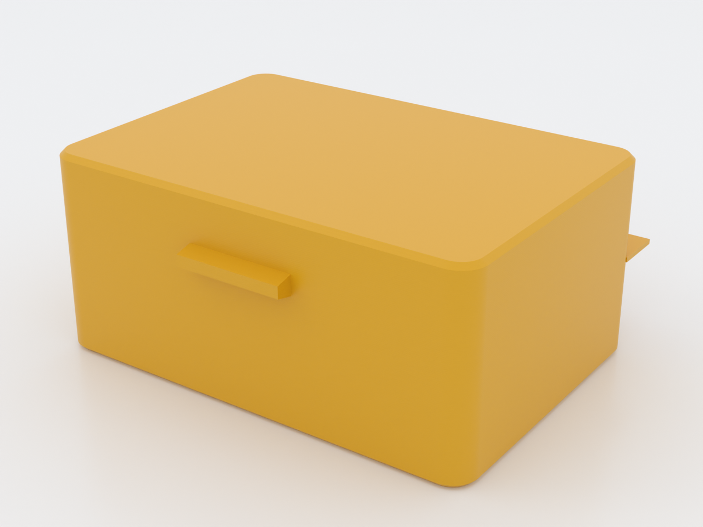
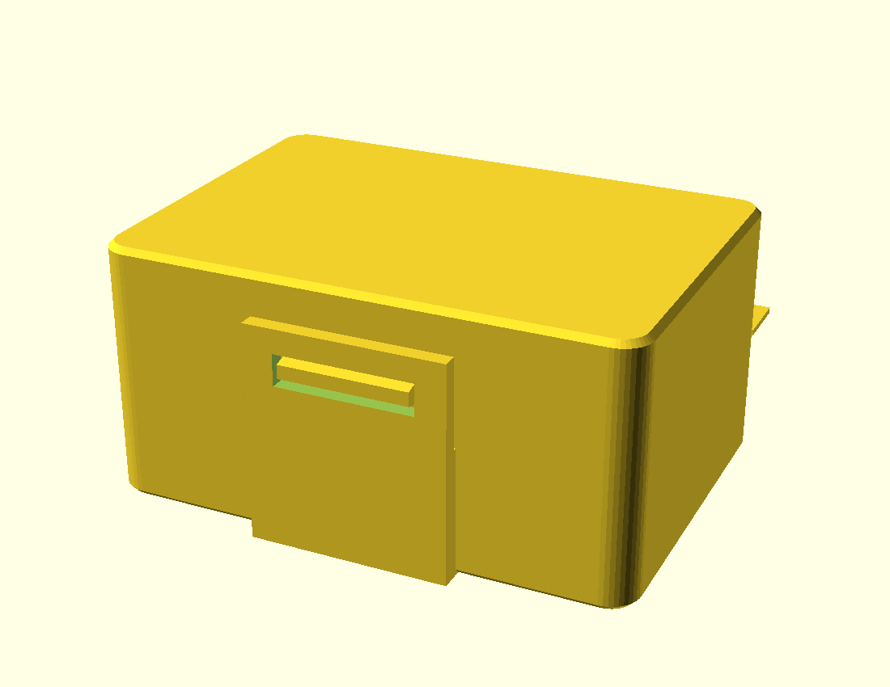

# snap-clamshell-box

A small clamshell box that prints **flat and assembled in one piece**, folds
closed, and snaps shut — no supports, no fasteners, no assembly. It fuses two
independent compliant sub-mechanisms: a **living hinge** joins the two trays and a
**compliant snap latch** holds them closed (`docs/advanced-techniques.md`, Domain
1 flexures + Domain 2 orientation).

*AI-generated impression for general illustration only — geometry is approximate and may not exactly match the printed part; see the studio render above and the STL for the true shape.*

Closed and latched (preview pose):

## What you get

- `snap-clamshell-box` — one flat print, ≈ 53 × 80.5 × 22 mm as printed (both
  trays open and flat, the latch strip standing proud of the rim); folds to a
  ≈ 53 × 43 × 26 mm closed box — the two tray-halves close face-to-face into one
  deep compartment. The closed interior clears ≈ 22.8 mm — enough to hold a pair
  of earbuds lying on their sides (21.8 mm is a bud's narrowest dimension; stood
  upright they do not fit). Expect a faint click from the stowed buds in a bag —
  the ~1 mm of clearance that makes them easy to drop in also lets them shift.

## Print settings

- **Material:** PETG / PP for the living hinge (it folds many times); PLA will
  crack at the hinge
- **Layer height:** 0.2 mm or finer — the 0.6 mm living hinge is exactly
  3 layers at 0.2 mm; 0.24 mm and coarser drops it to 2 and it will crack at
  the fold
- **Infill:** 20–30 %
- **Supports:** none needed
- **Seam position:** `Rear` — the default aligned seam lands on the latch
  strip's window corner (a crack-starter on the flexing arm) on 17 of 63 strip
  layers; `Rear` moves it to the strip's end corners (1 layer touching) and
  parks the body seam on the hidden spine side *(measured on the sliced gcode)*
- **Bridging angle:** `90°` — the hinge spine runs along X, so 90° runs each
  bridge line the short way across the 2 mm spine gap, anchored on both tray
  rims. Stock auto-detect already picks 90° on this geometry; setting it pins
  the choice *(measured: 113 spans, all at 90°)*
- **Hinge web, what the slicer actually does:** the 0.6 mm web is horizontal —
  not a thin wall — and slices as 3 stacked 0.2 mm layers: 3 concentric
  0.45 mm perimeter passes per side plus a bridged core across the spine gap on
  the first layer. "Detect thin walls" is not needed and changes nothing here
  *(measured)*

*The measured counts above come from stock PrusaSlicer with the repo gate's CLI
settings (0.4 mm nozzle, 0.2 mm layers); on another slicer or profile, re-slice
and verify — the recommendations hold, the exact counts may not.*
- **Orientation:** **flat, both trays open** (as modelled). Fold the lid 180° over
  the base after printing; the front tab snaps into the base window.

The two mechanisms: a thin **living-hinge web** across the spine (bends in the
layer plane), and a **tab-in-window snap** on the front whose halves are placed by
the 180° fold map (`tab_flat_z = 2·wall_h − win_z`) so they meet exactly when the
box closes.

## Parameters

| Parameter | Default | What it does |
|---|---|---|
| `inner_w` | 50 mm | inner tray width |
| `inner_d` | 34 mm | inner tray depth (each tray) |
| `wall_h` | 13 mm | wall height per tray (closed interior ≈ 2·(wall_h − floor_t)) |
| `hinge_t` | 0.6 mm | living-hinge web thickness (thin = folds easily; 0.4–1.0) |
| `hook` | 2.0 mm | hook depth over the lid rim; the tab reaches through the window, and retention comes from the window lands, not the hook |
| `latch_t` | 1.6 mm | latch strip (arm) thickness — drives snap stiffness; thickens outward, so the anti-clash clearance is preserved |
| `latch_h` | 9 mm | latch strip height above the rim — drives `win_z` and the fold map (`tab_flat_z`) |
| `hinge_gap` | 2.0 mm | spine gap between the trays that the hinge web bridges |
| `latch_clr` | 2.0 mm | outward standoff of the latch strip so it clears the closed lid wall (≥ `wall_t` + a print clearance, asserted in the model) |

All parameters are at the top of `snap-clamshell-box.scad`; override with
`-D 'inner_w=60'`. `demo_fold` is a preview pose only — print at 0.
