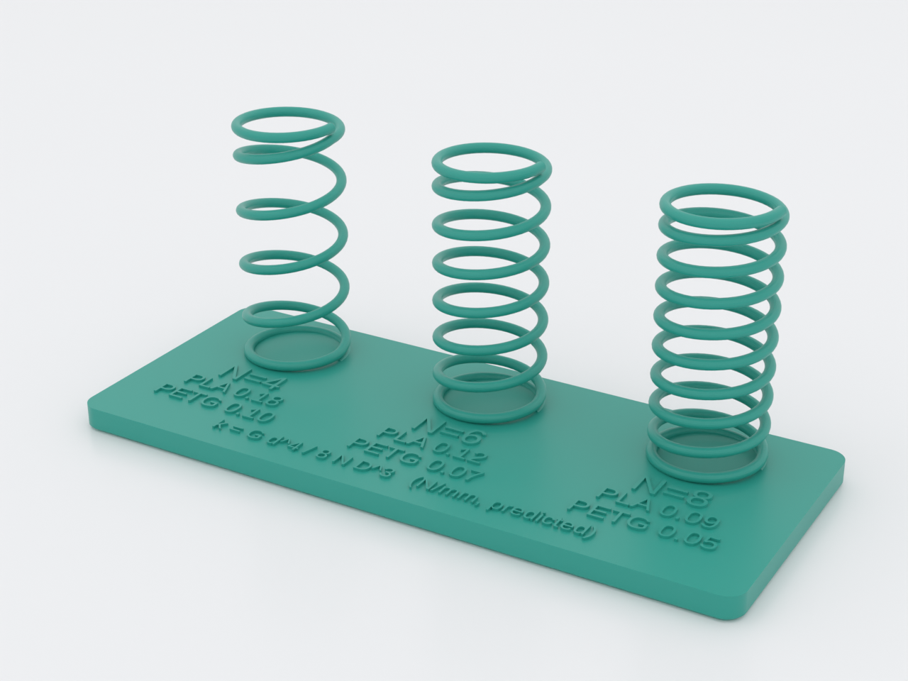
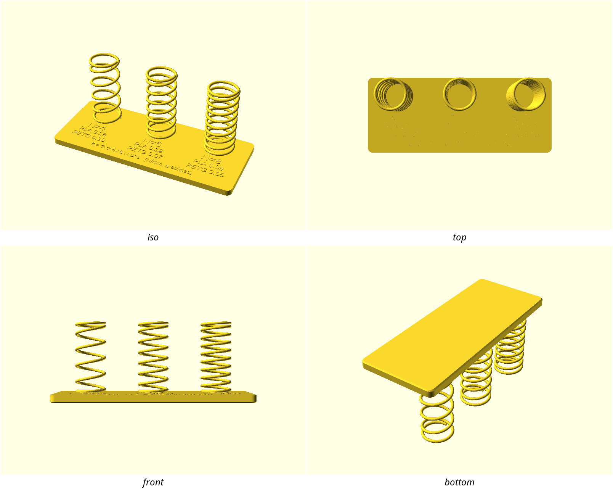
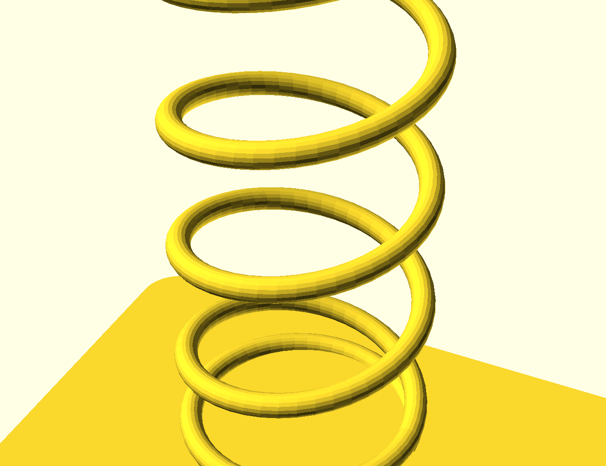
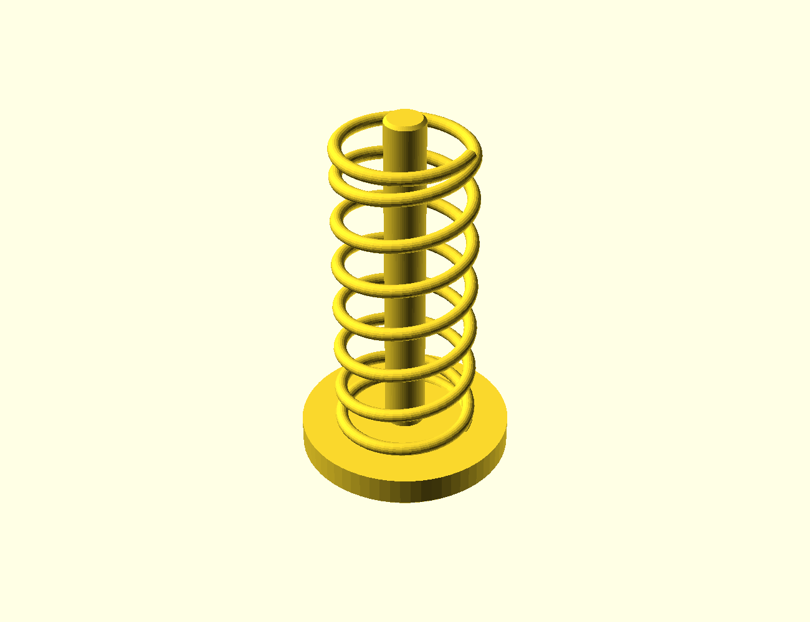
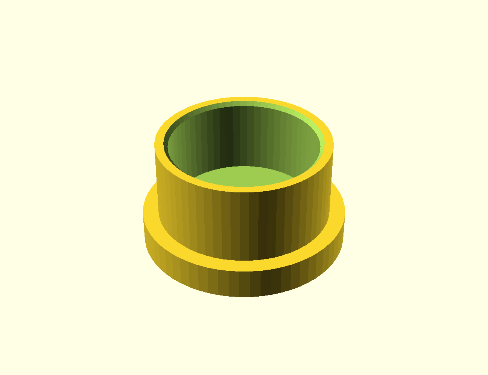

# spring-rate-ladder

Three printed helical compression springs on one baseplate, each with its
**predicted spring rate embossed beside it** — a physical k-probe for anyone
designing a compliant mechanism in printed plastic. Literature shear moduli
vary ±20 %, which is exactly the uncertainty this part removes: measure what
*your* filament actually does, back out its effective G, and design against a
number instead of a guess. The rates halve as coil count rises — k ∝ 1/N reads
straight off the plate.

## What you get

- `ladder` — one baseplate (108 × 44 × 44 mm) carrying three springs that
  differ **only** in active-coil count N = 4 / 6 / 8, each with its predicted
  PLA and PETG rate embossed on the plate (wire Ø 1.6 mm, coil mean Ø 16 mm,
  free length 40 mm, support-free).
- `coupon` — the measurement rig: a Ø26 pad, a guide post, and one N=6 spring
  (26 × 26 × 46 mm).
- `cap` — the guided press cap for the coupon (Ø26 × 14 mm): its skirt clears
  the spring OD while the centre hole rides the post, so the force you apply
  stays axial.

The embossed predictions (k in N/mm): N=4 — PLA 0.18 / PETG 0.10; N=6 —
0.12 / 0.07; N=8 — 0.09 / 0.05. They are computed inside the `.scad` from the
same parameters that build the geometry, so the plate can never state a number
the mesh didn't produce.

## Print settings

- **Material:** PLA or PETG — measuring the difference between them is half
  the point. Springs live or die by layer adhesion: PETG slow-cooled, PLA
  with plenty of part cooling.
- **Layer height:** 0.2 mm (the embossing is exactly two layers; the closed
  end-coil weld assumes ≤ 0.2).
- **Infill:** any (the plate is 4 mm solid-ish; perimeters matter more).
- **Supports:** none needed — the coil climbs at a 5–10° lead angle, so every
  wrap prints on the one below it, like a screw thread.
- **Orientation:** as modelled. Ladder plate-down, coupon pad-down, and the
  **cap disc-down** (the `cap` part is already modelled flipped for this — a
  cup, so its bearing face is a first-layer surface and nothing bridges).
- **Do not thin the wire:** k ∝ d⁴, so one perimeter of squish on the 1.6 mm
  wire is a measurable rate change. Print the wire at full width.

## Parameters

| Parameter | Default | What it does |
|---|---|---|
| `d_wire` | 1.6 mm | wire diameter — the k ∝ d⁴ knob (2.0 mm is the escalation if your printer facets the coil) |
| `d_mean` | 16 mm | coil mean diameter (index D/d = 10) |
| `l_free` | 40 mm | free length (wire-centreline to wire-centreline) |
| `ladder_ns` | [4, 6, 8] | active coils per station — the one variable the ladder compares |
| `G_pla` / `G_petg` | 3500 / 1950 MPa | shear moduli the embossed predictions use — literature values; the coupon measures yours |
| `coupon_n` | 6 | active coils on the coupon spring (matches the middle station) |
| `cap_spring_clearance` | 1.2 mm | cap skirt clearance over the spring OD (on the diameter) |
| `post_clearance` | 0.6 mm | cap centre-hole clearance over the guide post (on the diameter) |

All parameters are at the top of `spring-rate-ladder.scad`, grouped in
Customizer sections; override on the command line with
`-D 'd_wire=2.0'`.

## Assembly & use — measuring your filament's G

1. Print the `coupon` and the `cap`. Seat the cap: skirt over the spring,
   centre hole down the post. It must drop freely to the spring top (a 0.2 mm
   seating gap); if the post hole binds, raise `post_clearance` in +0.2 steps;
   if the skirt scrapes the coils, raise `cap_spring_clearance`.
2. Zero a kitchen scale with the rig on it. Press the cap and read force
   against cap-underside-to-pad-top distance (caliper) at a few deflections —
   say 5 / 10 / 15 / 20 mm. The slope of F(x) is your measured k (N = 6).
3. Back out your filament's effective shear modulus:
   **G = 8·N·D³·k / d⁴** (lengths in mm, k in N/mm → G in MPa).
4. Log it as a FIELD-TEST entry (`templates/FIELD-TEST.md`) — and if you opt
   into the print-feedback loop, that G is what `printer.conf` wants.

Honesty note, because the plate's own footer says *predicted*: fully
compressed to solid, the Wahl-corrected torsional stress is ≈ 61 / 36 / 24 MPa
(PLA) and ≈ 34 / 20 / 13 MPa (PETG) for N = 4/6/8. PLA's shear yield is
~35–45 MPa in the literature, so the N=4 station pressed flat in PLA sits
past it and will likely take set — measure, don't over-press. Lower G is
protective: force at solid scales with k.

