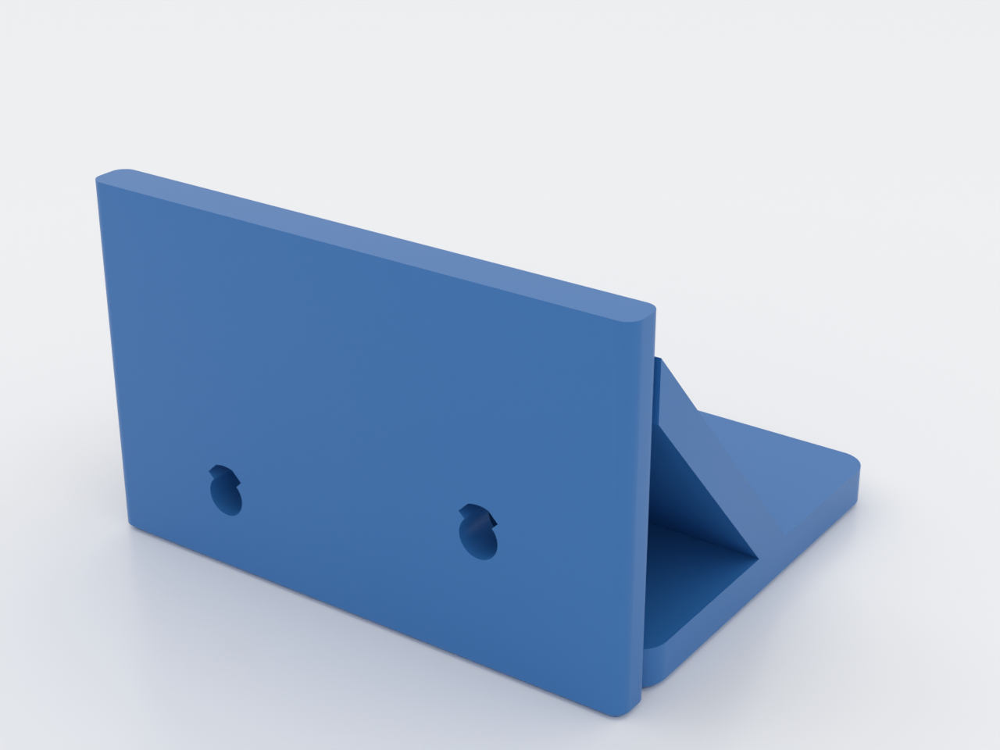
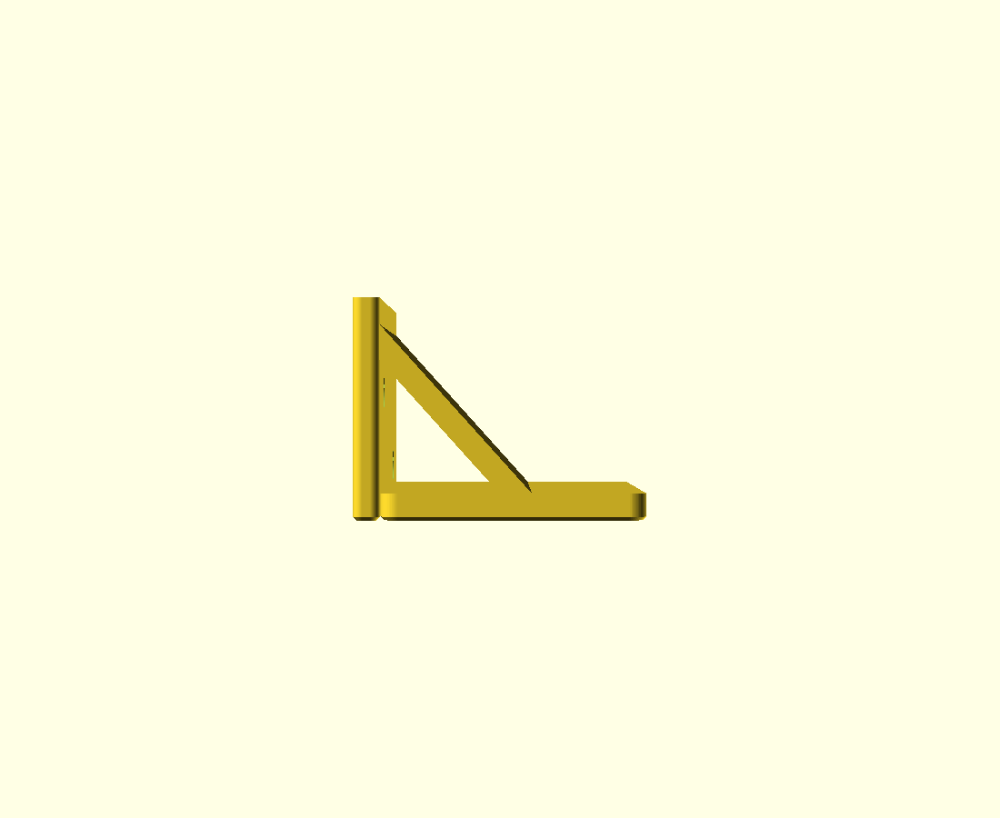
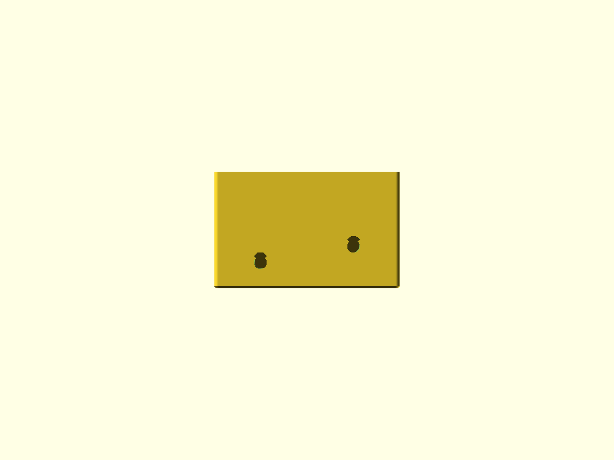
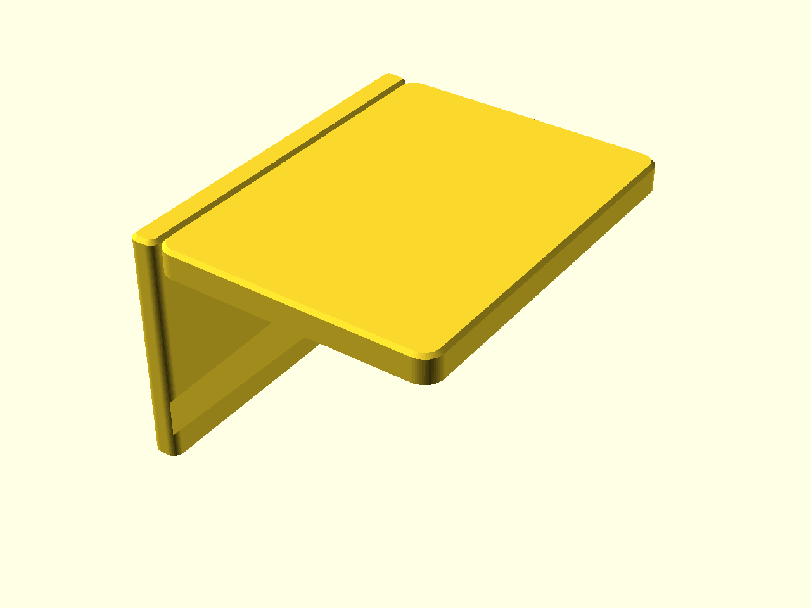

# support-free-bracket

A wall shelf bracket — 80 × 50 plate on two M5 screws, 60 mm arm — designed so
it prints with **zero support material**. It's a worked example of *designing
around supports* (`docs/advanced-techniques.md`, Domain 2): every feature that
would normally force supports has been reshaped so it doesn't.

## What you get

- `support-free-bracket` — one part, ≈ 80 × 66 × 50 mm as printed (80 × 60 × 50
  in use). Wall plate with two M5 teardrop bores, shelf arm, and a vaulted
  brace closing the cavity under the arm.

## Why it needs no supports

The cavity under the arm is closed by a diagonal brace whose inner face is a
**vault at 42° from vertical** — never a flat ceiling, which would print as an
unsupported bridge roof. Every layer of the vault rests on the one below it.

The M5 bores run horizontal in the print frame, so they are **teardrops** — a
45° peaked roof self-supports where a round bore's roof would droop. They are
clearance holes the screws pass *through*, not keyhole slots to hang from —
the point-up teardrop only borrows that shape.

Seen from below: the vault ceiling slopes over the open cavity and there is no
flat downward-facing surface anywhere. Print it with supports turned **off**.

## Print settings

- **Material:** PLA for a light or display shelf; **PETG or ASA for a loaded
  shelf** — the layer planes cross the peel load all year, and PLA creeps
  under sustained load. PETG note: this is an 80 × 66 mm slab of first layer,
  and PETG welds to smooth PEI — use a textured plate (or glue-stick release).
  (ASA wants an enclosed printer, or a draft shield — an open frame lifts the
  corners of that first-layer slab long before the vault is built.)
- **Layer height:** 0.2 mm
- **Infill:** 20–40 %
- **Seam:** Back — buries the ridge on the wall face (the default Aligned
  seam stacks it on the shelf's front edge)
- **Supports:** none — that's the whole point
- **Orientation:** as modelled — arm flat on the bed. To use, flip the print
  180° so the plate is against the wall and the arm is on top; the shelf board
  rests on the arm's smooth first-layer face.
- **Perimeters:** 3 (the 6 mm walls are three perimeters plus infill)

## Parameters

| Parameter | Default | What it does |
|---|---|---|
| `plate_w` | 80 mm | plate width, across the wall |
| `plate_h` | 50 mm | plate height up the wall |
| `plate_t` | 6 mm | plate thickness |
| `screw` | M5 | fastener size (M3–M6; bores are clearance holes) |
| `bore_inset_x` | 20 mm | bore inset from the plate ends |
| `bore_z_lo` / `bore_z_hi` | 11 / 18 mm | bore heights (slightly staggered for pull-out resistance; placed — and guarded — so an M5 socket head clears the arm face and the vault, and the hex key's short arm still has its run in front of the head) |
| `arm_d` | 60 mm | arm depth out from the wall |
| `arm_t` | 6 mm | arm thickness — the shelf rests on this face |
| `vault_deg` | 42° | vault ceiling angle from vertical (guarded ≤ 45° — above that it needs supports) |
| `bottom_chamfer` | 0.8 mm | 45° chamfer on bed-contact edges |

All parameters are at the top of `support-free-bracket.scad`, grouped in
Customizer sections; override on the command line with `-D 'arm_d=80'`.

## Assembly & use

Fasten the plate to wall studs or anchors with two M5 screws, flip-mounted
with the arm on top, and rest the shelf board on the arm — **and fasten the
board to the arm** (a short screw up through it, or adhesive): a typical
800 × 200 × 18 mm pine board is ≈1.6 kg with its centroid ~100 mm out,
forward of the 60 mm arm's support edge, so an unfastened board is its own
tip load before anything is shelved. Socket heads land
inside the cavity, and the bore heights are placed — and guarded in the
source — so the head clears the arm face and the vault ceiling; no counterbore
needed. Snug, don't crank: the plate *is* the washer, and PLA under a socket
head embeds under a load that never lets go, quietly relaxing the preload —
a steel M5 washer under each head buys that back. The vault-side screw is
hex-key-only: the vault face closes in about
16 mm out from the plate at that height, so nothing straight follows the
head — drive it with the short end of the L-key (it fits with a few degrees
of tilt; the bore heights are guarded for this driver envelope, not just for
the head), and spend the ~$2 on wall
anchors rated well past the load; they, not the bracket, are the real
insurance. Sized as a reference design for a ~1 kg-per-bracket shelf — an
**assumed** figure, with no field test behind it yet, and note a pair rated
that way spends most of its 2 kg budget on the shelf board itself. Scale
`plate_w`/`arm_d` for heavier loads and keep `vault_deg` at or below 45° —
the guard refuses anything steeper because it would break the no-supports
promise.
