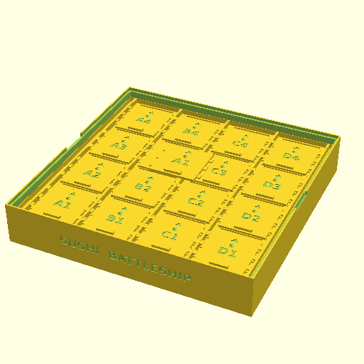

# Sushi Battleship Shot Tracker — assembly

## Bill of materials

| Part | Qty | Description |
|---|---|---|
| `tray()` | 1 | the tray (bottom half): 4×4 cell grid that holds the sushi pieces, with engraved coordinates on each cell floor |
| `lid_assembly()` | 1 | the print-in-place lid (top half): all 16 shutter doors captive in their rails, each door carrying a dished miss-marker seat |
| `door("A1")` | 1 | a spare shutter door with a marker seat — print to replace a captive door that breaks, or to tune door_fit |

## Assembly steps

1. Print the bottom tray and top lid flat-side-down with no supports; all 16 shutter doors print captive inside the lid in one piece.
2. Lower the lid onto the tray so its rim drops into the tray's inner ledge — it seats flush and self-aligns to the grid.
3. Keep a spare door on hand; if a captive shutter ever snaps, slide the broken door out of its rail and drop the spare in.
4. To record a called miss, park a marker (dried soybean, 6 mm BB, or peppercorn) in that door's dished seat — set marker_d to match yours.

