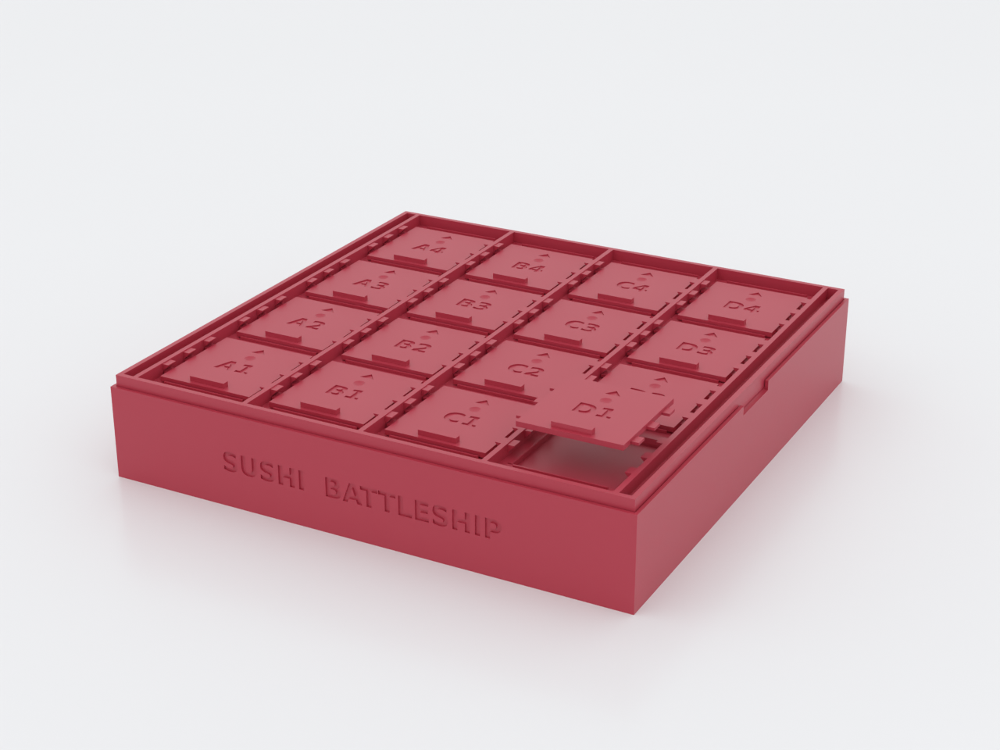
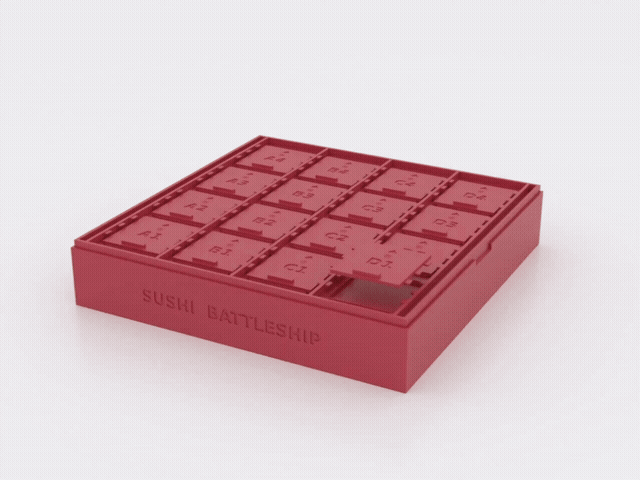
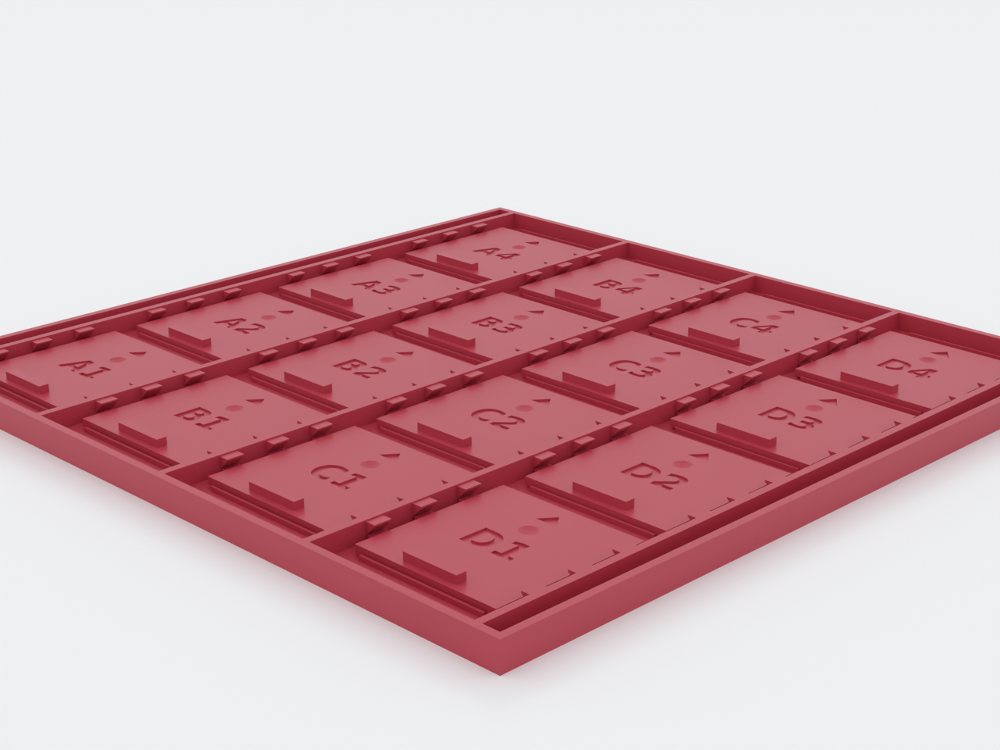

# Sushi Battleship — Shot Tracker

A shot-tracker refit of [Sushi Battleship](../sushi-battleship/): the same
two-part board for playing battleship with real sushi, with one addition —
every sliding shutter door now carries a shallow dished **miss-marker seat**.
Park a small round marker (a dried soybean, a 6 mm BB, a peppercorn) on any
cell that has been called, and nobody re-calls B3 three bites later. For
anyone who printed (or wants) the original and plays it slowly enough to
lose track of called shots — which is everyone eating dinner off it.

*AI-generated motion impression for general illustration only — geometry is approximate and may not exactly match the printed part, and the movement shown is illustrative, not a simulation; see the deterministic previews above and the STL for the true shape.*

This is a **derivative** of the archived
[sushi-battleship](../sushi-battleship/) (frozen at v0.1): its entry `.scad`
includes the parent verbatim and redefines only the shutter door. Everything
not described here — the tray, the print-in-place shutter mechanism, the
membranes, the whole game — is documented once, on the
[parent's page](../sushi-battleship/README.md).

## What you get

- `bottom` — the parent's tray, unchanged (≈ 254 × 254 × 44 mm; 4×4 cells
  for cut sushi-roll pieces)
- `top` — the print-in-place lid, all 16 shutters captive, each with a
  marker seat (≈ 250 × 250 × 9 mm)
- `door` — one spare/tuning shutter with the seat (≈ 48 × 50 mm)
- `sushi-battleship-tracker-coupon` — single-cell "print this first" test
  piece for tuning `door_fit` and marker fit

Markers are not printed parts: any roughly-spherical 4–10 mm household
object works — set `marker_d` to match yours (dried soybeans are on
theme).

## The delta

The seat is a spherical dish (Ø ~5.3 mm opening, 1.0 mm deep at the
defaults) cut into each door's top face between the coordinate engraving
and the push arrow. It adds zero height, changes no fit surface, and every
layer of the dish is wider than the one below it, so the print-in-place
scheme is untouched. A `door_fit` value tuned on the parent's coupon
carries over as-is.

## Print settings

Identical to the [parent](../sushi-battleship/README.md) — the refit moves
no printable surface except the door's top face:

- **Material:** PLA or PETG
- **Layer height:** 0.2 mm (membranes are quantized to it — see the parent's notes)
- **Infill:** 10–15 %
- **Supports:** none needed (the seat dish is self-supporting)
- **Orientation:** both parts flat as exported; the top prints with all
  doors captive in place
- **Print first:** the coupon — tune `door_fit` and drop your marker in the
  seat before committing to the full board

## Parameters

The refit's own knobs, plus the one inherited parameter you are most likely
to touch:

| Parameter | Default | What it does |
|---|---|---|
| `marker_d` | 8 mm | diameter of the marker the seat is dished for; asserted to the practical 4–10 mm range (peppercorn ~4–5, BB 6, soybean ~7–9) |
| `seat_depth` | 1.0 mm | how deep the seat is dished; coupled to `marker_d` by asserts — it must stay below the marker radius, leave ≥ 1.2 mm of door floor, and keep the seat rim ≥ 0.8 mm clear of the engravings |
| `door_fit` | 0 mm | inherited from the parent: door-only fit tuning in ±0.1 steps |

Everything else — grid size, roll diameter, clearances — is the parent's
parameter set, inherited unchanged; see the top of
[`sushi-battleship.scad`](../sushi-battleship/sushi-battleship.scad).
Override on the command line with `-D 'marker_d=6'`.

## Assembly & use

Play exactly as the parent describes. The one new rule: when a shot is
called and misses, the *defender* parks a marker in the called door's seat.
An open door is a hit, a marked door is a spent miss, an unmarked closed
door is fair game. The seat is identical on all 16 doors, so markers leak
nothing about where the sushi fleet actually is.
