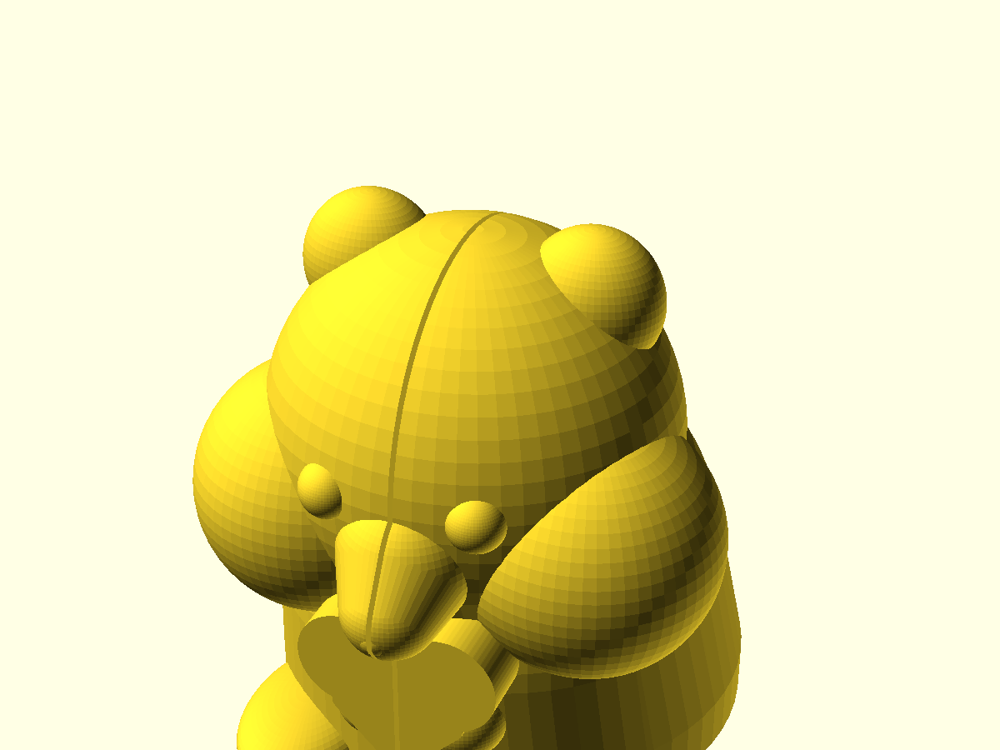
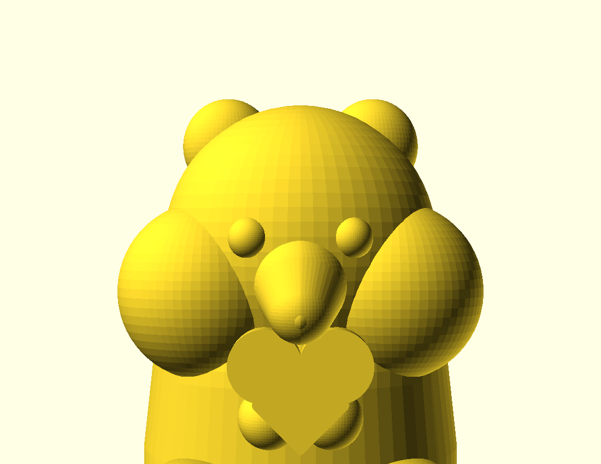
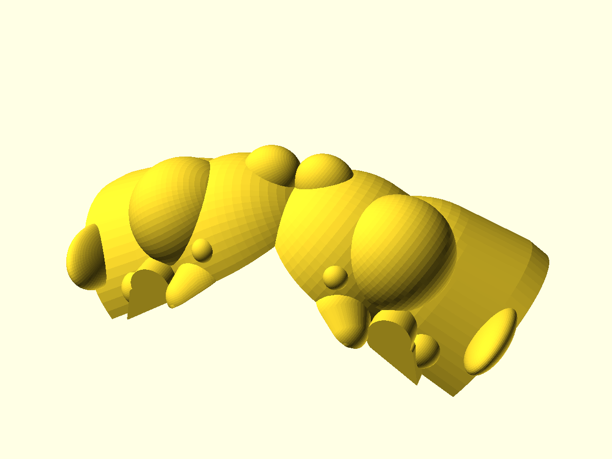

# Sweetheart Hamster

A palm-sized jewelry box shaped like a chubby chibi hamster **cradling a heart**.
It prints in one piece — no assembly — and folds open along a living-hinge spine
like a locket. Closed, it's a cute hamster hugging a heart; split down the
middle, the heart parts between the two halves, and a heart-shaped pocket inside
nestles a ring. A giftable little keepsake for a proposal, an anniversary, or a
Valentine.

## What you get

One print-in-place part — the two hamster halves come off the bed joined by a
thin living-hinge web along the dorsal seam, so it prints already assembled and
folds shut.

- `sweetheart-hamster` — the hamster locket, **~53 × 61 × 60 mm** assembled;
  ring nest ~22 mm across. Prints flat/open, ~126 mm wide on the bed.
- `sweetheart-hamster-coupon` — a smaller "print this first" copy to dial in the
  hinge flex and seam fit before committing to the full print.

## Print settings

- **Material:** PETG or PP recommended — the living-hinge spine flexes for many
  open/close cycles. **PLA works but is brittle at the hinge:** treat the halves
  as separable (the thin web is a tear-line) rather than a repeatedly-folding
  lid.
- **Layer height:** 0.2 mm.
- **Infill:** 10–15 % is plenty (decorative box). Default-density slicing runs
  ~36 g / ~2.5 h; low infill cuts both substantially.
- **Supports:** none for the body — it prints flat/open, cut-faces down, domes
  self-supporting. ~3 % of the surface (the ring-nest ceiling and a couple of
  underside curves) is technically overhang. **Keep auto-supports OFF.** The nest
  prints as a heart-shaped arch opening at the bed; only its small crown — where
  the lobes curl over — is a real overhang, and a sagging crown droops *into* the
  pocket and eats the headroom a ring's stone needs. If the fit matters, **paint a
  support enforcer on the nest crown only** — a global "enable supports" drops
  pillars into the 0.5 mm parting gap (re-welding the seam this design is built to
  keep open) and scabs the cheeks and the pocket the ring seats against. Note that
  PETG (the recommended material) sags on that crown more than PLA does, so a
  truly stone-flush ceiling is really a PLA job — at the cost of the hinge (see
  **Material**).
- **Seam:** set the seam to **Back** (or use a scarf seam) — the slicer's default
  aligned seam stacks a vertical ridge down the show dome (a scar on the cheek of
  a gift print); moving it to the back keeps the face clean.
- **Orientation:** as modelled — the default render **is** the print pose (both
  halves flat, cut-face-down, hinge in the middle). Don't re-orient.
- **First layer & plate:** the cut faces print as the first layer — and that's the
  heart-reveal surface the whole gift points at. On **textured PEI** it comes out
  matte (expected — it reads like a flocked jewelry-box liner); expect a faint
  elephant-foot flare around the seam silhouette (nose, brow, ears, tail), which
  0.2 mm elephant-foot compensation cleans up if you care. Don't chase a glossy
  reveal with PETG on **smooth** PEI without a glue-stick release — it welds to the
  plate and you'll chip the reveal face lifting the print. Textured PEI is the safe
  choice.
- **Print this first:** the coupon, to dial in the hinge flex and seam
  clearance for your printer before committing to the full print.

## Parameters

The handful worth tuning; all parameters are at the top of
`sweetheart-hamster.scad`, grouped in Customizer sections.

| Parameter | Default | What it does |
|---|---|---|
| `S` | 1.70 | Overall scale (1.70 ≈ 60 mm tall assembled) |
| `heart_w` | 20 mm | Width of the belly heart the hamster cradles |
| `heart_proud` | 4 mm | How far the belly heart stands off the skin |
| `nest_w` | 22 mm | Ring-nest heart cavity width |
| `nest_depth` | 6 mm | Nest depth into each half (total ≈ 12 mm closed) |
| `part_gap` | 0.5 mm | Seam parting clearance — raise if the halves fit tight |
| `web_t` | 0.7 mm | Living-hinge flexure thickness |
| `fold` | 0 | Preview only: 0 = flat print pose, 90 = assembled |

Two worth setting for *your* ring and printer:

- **`nest_w` — size it to the ring.** Set it to the band's outer Ø + ~0.5 mm so
  the ring seats snugly; the 22 mm default suits roughly a US-7 band, and a band
  looser than the pocket will roll, shift, and rattle in the closed box.
- **`web_t` and layer height.** At the pinned 0.2 mm layers, `web_t = 0.7` mm is
  3.5 layers, so a slicer rounds it to 0.6 or 0.8 mm (±14 % flexure stiffness).
  Pick **0.6 or 0.8** for a predictable hinge, and A/B it on the coupon.

Override on the command line, e.g. `-D 'S=1.5'` for a smaller hamster or
`-D 'fold=90'` to preview it closed.

## Assembly & use

Nothing to assemble — it prints as one piece, splayed flat and open. The hinge
runs along the **top of the spine** (dorsal), so in the print/open pose both heart
scoops face *down*. To load it: turn the open piece scoops-up, set the ring into a
scoop, then fold the two halves shut about the spine. The reveal runs in reverse —
unfolding parts the halves and the ring lifts free of the scoop as they open, so
open it over a hand or the table, not in mid-air. The closed hamster carries a
small tab along the top of the spine between the ears — that's the living hinge,
printed flat and folded up, and it stays on the finished piece. A light tack
across the seam at the very first layer is normal elephant foot — flex the halves
gently to break it before first use (a non-event in PETG; in PLA expect a faint
whitened crack along the seam). If the halves fit tight at the seam, raise
`part_gap` and reprint, tuned on the coupon first.

The box has no catch — it holds shut by friction alone — so **carry the print
flat and empty, and load the ring at the table** just before folding it shut: not
in a pocket, and not pre-loaded in a bag, where an open box jostled in transit
lets the ring hop its scoop (and a ring looser than the pocket rattles in the
closed box — a tell). Print in PETG if you want the hinge to fold repeatedly.
