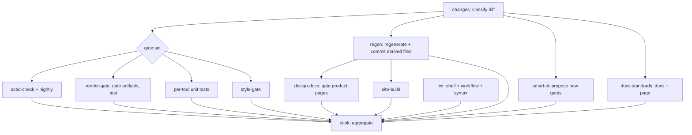

# CI & automation platform

The domain-agnostic half of print-bench: how any repository built this way
selects its gates, keeps derived files honest, and runs unattended agents. Read
it as the template skeleton. Where it names a domain script (`gate.sh`,
`render.sh`) that name is a seam — see the [architecture index](README.md).

## Invariants

Five rules the whole platform is built to hold. Break one and the failure is
silent, which is why each has a mechanism, not a convention.

1. **A skipped required check does not satisfy branch protection.** GitHub
   treats a skipped required context as still-pending, and the PR never merges
   (learned on PR #50). So required jobs always *run* and decide internally
   whether they have work — they never gate themselves out with a workflow-level
   `paths:` filter. Job `name:` strings are load-bearing: branch protection
   matches on them.
2. **A committed derived file can never be older than its source.** Anything
   generated *from* tracked source is regenerated and committed by CI in the
   same run that gates the source. Gates on derived files are then
   presence-only, and still correct.
3. **The "what runs" decision has one source of truth.** CI and the local
   pre-push check read the *same* classifier script over the same diff, so
   "would CI pass?" locally can't drift from CI.
4. **A new blocking check never lands unannounced.** Gates that can fail a PR
   default to *proposed* and require an explicit human cross; only advisory
   (non-failing) gates auto-enable.
5. **Automation acts only when config-in-git and a live switch agree.** A clone
   or fork can't silently arm an agent; a human can disarm one in seconds.

## The pipeline

`.github/workflows/ci.yml`. One `changes` job classifies the diff; every other
job keys off its outputs.

**Gate selection is deterministic.** `scripts/ci-classify.sh` takes the
changed-file list and emits which gates run and over which units. A docs-only
diff skips the render jobs; a single-design diff gates only that design (plus
its dependents); an infra change (shared library, generator script, workflow)
gates everything. The `changes` job only computes the diff and event mode — the
script owns the policy, and `/preflight` runs it with `--local` so the local
mirror is the same code.

**`ci-ok` is the aggregation gate.** It `needs:` every other job and passes only
if each is `success` or `skipped`. Branch-protect this one context instead of a
dozen, and the classifier can skip jobs freely without stranding a PR — `ci-ok`
runs on `!cancelled()` so it always reports.

**Two render engines, on purpose.** A stable build is the compatibility
baseline for what most users run; a nightly build with the faster backend is
what the gate actually renders on. Both run so a nightly-only regression is
caught before it reaches the gate. (Domain detail: [OpenSCAD](design-workflow.md).)

## Regenerate-and-commit

The mechanism behind invariant 2, and the platform's most reusable idea.
Derived artifacts (previews, galleries, generated pages) are **not** authored by
hand. The ungated `regen` job runs the domain generators for the designs a PR
touched and commits the result back to the PR branch.

Three parts make it safe:

- **Input fingerprint.** `scripts/regen-stamp.sh` hashes a unit's inputs against
  a committed stamp; an unchanged unit is skipped, and the stamp is written in
  the same commit as the artifacts so it can't claim false freshness.
- **Loop guard.** The commit-back re-triggers CI (see tokens below), so a
  non-reproducible generator could push forever. The job recognises its own
  last commit at `HEAD` and refuses a second push — bounding the cycle at two
  runs and warning if the second pass produced different bytes.
- **Fork fallback.** CI can't push to a fork, so there `regen` fails with the
  exact file list to regenerate by hand instead of skipping silently.

### The token rule (generic, and easy to get wrong)

A push made with the default `GITHUB_TOKEN` triggers **no** workflow. That fact
cuts both ways, and the platform uses both directions:

| Push | Token | Why |
|---|---|---|
| `regen` commits artifacts back to a PR | **PAT** (`REGEN_TOKEN`) | must re-trigger CI so required checks attach to the commit that ships; a `GITHUB_TOKEN` commit would move the PR head onto a commit with no checks and nothing to add them — permanently unmergeable |
| `ci-gate approve` edits the registry | **PAT** | same: the newly-enabled gate must run |
| telemetry roll-up on main | **`GITHUB_TOKEN`** (deliberately) | must *not* re-trigger, or every telemetry commit would gate the catalog, record itself, and commit forever |

Checkouts run `persist-credentials: false`; the push token is handed to the one
step that pushes, so the generators that run in between never hold it.

## Smart CI: proposing gates that don't exist yet

Above the classifier (which picks among gates that exist) sits
`tools/ci-gates/`, which proposes new ones. Three parts, kept separate:

- **Detectors** — pure functions of the changed-file list deciding whether a
  candidate gate applies (e.g. a shell script changed with no shellcheck gate).
- **Registry** (`.github/ci-gates/registry.conf`) — the committed decision per
  candidate (`on`/`proposed`/`off`) and its tier. Git-tracked, so every run
  reads it identically; GitHub supplies only interaction and auth.
- **Selector** — joins the two into buckets the `smart-ci` job runs and a sticky
  PR comment reports.

The tier *is* the auto-approve policy (invariant 4): **advisory** gates run
automatically; **gating** gates stay proposals until a human crosses them.

## Config-as-data + comment-commands + privileged workflows

A pattern that recurs across the platform (`ci-gates`, `backlog-burn`,
`decide`): the decision lives as **data in git**; a **PR/issue comment command**
mutates it; a **privileged workflow** authorizes and applies the change.

The security shape matters and is the same every time:

- The privileged workflow triggers on `issue_comment` (so it holds secrets and
  the PAT). It therefore **never checks out or runs the PR head's code** — it
  edits the head branch's config *as data* with the base repo's trusted tooling,
  and commits via the Contents API.
- Authorization is the commenter's real repository permission, not a string in
  the comment.
- From a fork (nothing to commit to), the command's response says to edit the
  config file in the PR instead.

See [`actions-security.md`](../actions-security.md) for the accepted posture on
`workflow_dispatch`/`push` branch selection.

## The autonomy engine

Unattended agents that turn issues into draft PRs. The reusable core is
`tools/backlog-burn/`: a **pure, tested selector** that picks at most one issue
per firing — filtered to an opt-in label, oldest-first, excluding anything
already claimed by an active lock, an open closing PR, a work branch, or a
human-decision hold. It has a negative control per guard.

Everything else composes that one selector:

- **Backlog burn** (`.github/workflows/backlog-burn.yml`) runs `/ship-issue` on
  the selected issue.
- **Design run** and **chunker** point the *same* selector at different labels
  (`design-brief`, `declined-too-big`) via their own committed config files.
  There is one tested selector, not three.
- **Arming is two-key** (invariant 5): a committed `*.conf` (the reproducible
  policy) *and* a repo variable (the live kill switch) must both agree.
- **Provider is config.** The LLM behind a run is a committed `provider:` label;
  each provider has an explicit git-tracked ship step (Actions requires literal
  secret references). A run skips with a notice when its provider's secret is
  absent.

The loop closes on itself: `/ship-issue` declines an over-large issue and labels
it → the chunker splits it into one-PR-sized children and arms the small ones →
the burn ships them.

### Human-in-the-loop decision gate

When an agentic run hits a binary question a human must answer, it parks the
issue with a `needs-decision` label (unspoofable — adding one needs write
access) and stops. A maintainer answers with a `/decide yes|no` comment; the
label is the authoritative verdict and `.github/decisions/ledger.conf` is the
audit trail. Full design: [`decision-gate.md`](../decision-gate.md).

## Telemetry

The repo measures itself. `render-gate` captures one JSON record per gate run
(scores, per-unit wall time, budget headroom, what was skipped and why) and, on
default-branch pushes only, appends it to a committed log — pushed with
`GITHUB_TOKEN` precisely so it doesn't re-trigger (see the token table). The
autonomy features read this log so their decisions can be data-driven rather
than guessed.

## Static site

`scripts/site.sh` builds a static product site from what the repo already
commits — it invents no content. The local and CI build is deterministic and
offline; the live deploy may fetch first-party data (release manifests, repo
history) through a best-effort seam that stays empty on failure. "No external
references" governs the served bytes: everything the browser loads is vendored,
never a CDN. A local reference that doesn't resolve fails the build.

## What to keep when templating

Keep: the `changes`/`ci-classify` seam, `ci-ok` aggregation, the
regenerate-and-commit job with its token rules and loop guard, Smart CI, the
config-as-data/comment-command/privileged-workflow pattern, the backlog-burn
selector and two-key arming, the decision gate, telemetry. Replace: the
generator scripts, the gates, and the classifier's path→gate table.
