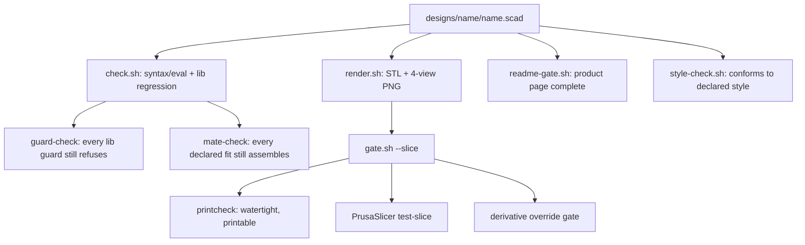
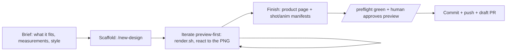

# Design workflow

The domain half: what print-bench actually builds, and the gates that decide a
design is done. This is the layer you replace to retarget the
[platform](ci-platform.md). It plugs in at the three seams named in the
[index](README.md) — classification, regeneration, gating.

## The design unit

One directory per design, `designs/<name>/`. The entry point is the `.scad`
matching the directory name; everything else supports it.

| File | Role | Gated by |
|---|---|---|
| `<name>.scad` | parametric source, the one authored artifact | render + printcheck + slice |
| `NOTES.md` | engineering log — decisions, measurements, resume context | presence (`docs-check.sh`) |
| `README.md` | **product page** — what it is, print settings, tunable params | `readme-gate.sh` |
| `PM.md` | product charter — customer, non-negotiables, scope, backlog | — (read by `/pm`) |
| `<name>-coupon.scad` | "print this first" test wrapper for a tuned fit | gated like any part |
| `ci.parts` | which `part=` values are printable parts to gate | drives `gate.sh` |
| `previews/cameras.conf`, `animations.conf`, `shots.conf` | derived-artifact manifests | presence + budget |
| `derives.conf` | lineage record for a derivative design | `lineage.sh` + render gate |
| `style.conf` | names a style the design must conform to | `style-check.sh` |
| `ARCHIVED` | freezes the design at v0.1, retires it from full-catalog CI | — |

Everything under `previews/` is **derived** — CI regenerates and commits it (the
regeneration seam). The author owns the `.scad`, the prose, and the manifests;
CI owns the pixels.

## The gate stack

A design is done when the geometry survives every gate below, not when it
renders. `render.sh` alone is not the bar — `gate.sh --slice` is.

- **`render.sh <name>`** → `build/<name>.stl` + a 2×2 contact sheet (iso / top /
  front / bottom-iso). The bottom-iso view exists to catch overhangs and bed
  contact — look at it.
- **`check.sh`** — fast pre-commit pass: echo-checks every `.scad`, CGAL-renders
  the library demos (they *are* the library regression tests), fires
  `guard-check.sh` (every `lib/*-guards.conf` case a library must refuse) and
  `mate-check.sh` (every `lib/*-mates.conf` fit that must assemble, plus a
  deliberately-interfering control), and runs `docs-check.sh`.
- **`gate.sh --slice`** — the bar CI enforces: renders each printable part,
  runs the printcheck analyzer (watertightness, thin walls, overhangs), and
  test-slices with PrusaSlicer. Picks up the coupon automatically.
- **`readme-gate.sh`** — every design ships a complete product page. Checks are
  presence-only (title, pitch, embedded preview under budget, Print settings +
  Parameters sections) because the regeneration seam guarantees the embedded
  images aren't stale.

`/preflight` runs exactly this set, scoped the way CI scopes it. It's the single
answer to "would CI pass?".

## Libraries

OpenSCAD `include`/`use`, resolved through `OPENSCADPATH="$PWD/lib:$PWD"` (the
scripts set it; call OpenSCAD directly and an unresolved include only *warns*,
then ships a watertight STL with the feature silently missing).

- **Vendored, third-party, never edited:** BOSL2 (`lib/BOSL2/`, BSD-2-Clause —
  permissive) and NopSCADlib (`lib/NopSCADlib/`, GPL-3.0 — copyleft). The
  license reach differs and is enforced: see [`licensing.md`](../licensing.md)
  and `license-boundary-check.sh`.
- **First-party** (`lib/*.scad`): FDM helpers (`printability.scad`), printable
  threads (`threads-fdm.scad`), print-in-place mechanisms (`print-in-place.scad`),
  the NUGGS coupling standard (`nuggs-coupling.scad`), the print-feedback profile
  (`printer-conf.scad`). Anything used by two or more designs belongs here.

Every first-party library ships enforcement a render alone can't provide:

- a `lib/<name>-demo.scad` exercising every module — CGAL-rendered by
  `check.sh`, so it's the regression test.
- a `lib/<name>-guards.conf` if its modules assert — one line per parameter set
  the library must *refuse*. A firing assert aborts its own render, so without
  these a guard could be deleted and every check stays green.
- a `lib/<name>-mates.conf` if it has a tuned fit — one line per pair that must
  assemble (measured as zero facets of interference), plus a
  deliberately-interfering control proving the check can fail. A demo can only
  restate a clearance formula; it can't measure that the built geometry honors
  it.

## The co-design loop

The repo is used session-per-design: one idea in, one gated design out.

Iteration is **preview-first**: after each meaningful change, render and react
to the shape, not the code. The human approves the *look*; the gates approve the
*printability*. Skills codify each step (`/new-design`, `/product-shots`, `/pm`,
`/ship-issue`, and the reviewer personas `/jane-review`, `/drik-review`,
`/design-coach`). `/design-run` runs the whole loop unattended but **converges on
gates, never on taste** — it drives geometry to gate-clean and hands off,
because approving a shape is the human's merge decision.

## Domain concepts

- **Styles** (`styles/<name>/`) — a design language measured out of a reference
  mesh (edge softness, rounding vocabulary, chamfer grammar, feature sizes) into
  a checkable spec. `style.json` is the source of truth; `style.scad` and the
  docs are generated from it. A design opts in via `style.conf` and builds from
  the tokens, so it conforms by construction. Style constrains *look*, not
  printability — when they conflict, printability wins.
- **Derivatives & lineage** — a design that `include`s another and redefines
  parts of it. Because OpenSCAD reports *nothing* when a redefinition binds
  nothing, `derives.conf` records the claimed overrides and the render gate
  proves each one actually changed the mesh. Read
  [`derivative-designs.md`](../derivative-designs.md) before building on another
  design — it documents the four silent failure modes.
- **Coupons** — a design with a tuned fit (threads, sliding doors, press-fits)
  ships a ≤10-line "print this first" wrapper over the production modules
  (never copied geometry), so a user dials in the fit on a small print.
- **Print-feedback loop** (opt-in, feature-flagged) — `printer.conf` carries a
  printer's measured tolerances; a design reads them instead of a generic
  clearance. FIELD-TEST entries in NOTES.md record real prints. Ships inert, so
  the off state is the default. See [`print-feedback.md`](../print-feedback.md).
- **Product shots, tiered** — tier-1 is a geometry-true studio render
  (path-traced from the same STL export the part uses; deterministic, CI-gated).
  Tier-1.5 is an AI **product still** — the bare part in isolation, photoreal,
  image-to-image seeded from a tier-1 render (so its angle *is* the tier-1 shot
  it seeds); it is shown on the page and gated like any preview. Tier-2 is
  AI-generated lifestyle imagery/motion — a world around the part, or its
  movement — each AI hop image-to-image/-video seeded from the render before it
  (raytrace → product still → lifestyle scene → motion clip). Every AI tier is
  cosmetic and geometry-approximate, gated for presence *and* an honest
  disclosure label, never for pixels.
- **Archiving** — an `ARCHIVED` marker freezes a design at v0.1 and retires it
  from every full-catalog CI run, so it stops spending render/slice cycles. It's
  still gated by a PR that edits its own files, and still appears on the site.
  Revive by working on it again or lifting the marker.

## Render engines

OpenSCAD runs headless here — every invocation goes through `xvfb-run -a`. Two
builds run in CI (the platform's "two engines" note): the stable 2021.01
release is the compatibility baseline most users have; the nightly snapshot with
`--backend=manifold` is order-of-magnitude faster on these models and is what
the gate renders on. Scripts honor `OPENSCAD_BIN` / `OPENSCAD_ARGS` so a design
never hardcodes a nightly-only flag.
