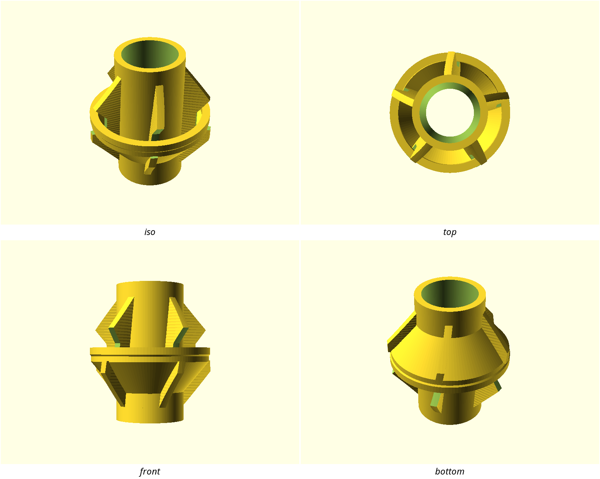

# Orrery

A kinetic machine-jewellery language: helically twisted blade cages around a
core, carrying **captive, free-moving rings in a contrasting second
material**, every seat and lead-in cut at the same 50° self-supporting cone.
A part in this style looks like it is mid-motion even when still — and its
signature move is that the moving piece *cannot be removed and was never
installed*: it was printed where it lives.

The family in one sentence: **vertical drama (twisted sharp blades), one
chamfer (the 50° ramp, everywhere), and at least one trapped thing that
moves.**

## Do / Don't

- **Do** cut every lead-in, roof, seat and flare at `style_ramp_deg` — one
  angle for the whole part. The ramp is simultaneously the look and the
  reason the style needs no supports; a second chamfer angle reads as
  another family.
- **Do** keep blades `style_blade_th` thick, knife-edged (no rounding on
  blade edges), twisted at about `style_blade_twist_rate` °/mm of height.
  Guard the lean: `atan(r_max · rate·π/180) ≤ 40°`.
- **Do** give every piece at least one captive element on a conical seat —
  ring height `style_ring_h`, print-time seat clearance `style_seat_gap`,
  hole at least 1.5 mm smaller in radius than the cage that traps it.
- **Do** print the moving elements in the second, non-welding material; the
  seat that supports them during the print is the bearing afterwards.
- **Don't** round the silhouette. The reference's 42 mm "corner radius" is
  its tube barrel — form, not edge treatment — which is why this pack ships
  no `style_corner_r`.
- **Don't** carry a fastener vocabulary over from the reference: its 80 mm
  bore is the NUGGS welfare standard, not a style choice.
- **Don't** let the massing go blocky: the form is a carved cage, most of
  the bounding box is air.

## Where it comes from

- `nuggs-orrery-kinetic.stl` — sha256 `84385a5b72a3705e…`
  - source: first-party: designs/nuggs-orrery in this repository (part=kinetic render)
  - author / license: CC BY-SA 4.0 (this repository's own license)

The reference mesh itself is **not** committed unless its license allows redistribution — the hash above identifies it, and every number on this page was measured from it.

## The rules

What a new design must do to belong to this family. `stylelift check` enforces these against the design's exported STL; a rule whose precondition does not apply to a given part is skipped, not failed.

<!-- stylelift:rules -->
| Rule | Requirement | Severity | Why |
|---|---|---|---|
| `curve-smoothness` | `edges.rounding.implied_fn` ≥ 89 | required | large visible curves in this family are drawn at about $fn=128; visibly faceted barrels and rings break the family look. Scoped to parts whose dominant rounding is >= 10 mm: on a small accent piece the estimator reads the deliberately faceted ring cross-section as a coarse sub-3 mm circle (measured on the reference's own orbit STL), and that is section grammar, not a curve |
| `soft-edges` | `edges.softness` ≥ 0.49 | advisory | this is a soft family: most of its edge length curves rather than turning a corner (falls as a part grows, so advisory) |
| `grammar-sharp` | `edges.grammar.sharp_share` ≥ 0.4 | advisory | the blades are knife-clean: the reference treats 67% of its shaped edge length as sharp, and softening the blades reads as a different family |
| `ramp-grammar` | `orientation.sloped_share` ≥ 0.15 | required | the family's one chamfer is the ramp_deg cone: lead-ins, groove roofs and ring seats are all the same 50-degree cut, which is what makes the style supportless. Required because it is the one signature every family part carries (reference body 0.36, its orbit rings 0.24, the swatch 0.36) |
| `massing` | `massing.bbox_fill` ≤ 0.3 | advisory | the form is carved away, never blocky — a vortex cage fills well under a third of its bounding box (the reference fills 8%, the swatch 15%) |
<!-- /stylelift:rules -->

## Tokens

Numbers to build with. `include <styles/orrery/style.scad>` and use these rather than retyping the values — a design written from the tokens passes the rules by construction.

<!-- stylelift:tokens -->
| Token | Value | What it is |
|---|---|---|
| `style_fn` | 128 segments | curve resolution ($fn) the family draws at |
| `style_blade_th` | 2.4 | defined by this style — see the prose below |
| `style_blade_twist_rate` | 0.51 | defined by this style — see the prose below |
| `style_ramp_deg` | 50 | defined by this style — see the prose below |
| `style_ring_h` | 3.6 | defined by this style — see the prose below |
| `style_seat_gap` | 0.1 | defined by this style — see the prose below |
<!-- /stylelift:tokens -->

## Measured evidence

<!-- stylelift:evidence -->
| Property | Reference |
|---|---|
| Edge softness | 0.82 (1.0 = every edge curves) |
| Edge grammar | rounded 33% / chamfered 1% / sharp 67% |
| Rounding vocabulary | 42.4329 mm (53%), 48.393 mm (19%), 2.8981 mm (19%) |
| Form curvature (the shape, not its edges) | 57.2 mm |
| Chamfer leg | 3.85 mm |
| Fills its bounding box | 8% |
| Round feature | 3 x boss 114 mm diameter, z axis |
| Round feature | 1 x hole 80 mm diameter, z axis |
<!-- /stylelift:evidence -->

## What the mesh cannot tell you

Asserted by a human, not measured (mirrored in `asserted` in style.json):

- **Material / colour:** dark, low-sheen body (PETG in the reference);
  saturated, high-contrast accent material for the moving rings — the second
  material is meant to be *seen moving*. The pairing is functional, not
  cosmetic: the two materials must not weld (PETG + PLA in the reference),
  because the anti-bond interface is what frees the captive elements.
- **Finish:** layer lines left visible; the helical blades turn them into a
  surface texture that follows the twist.
- **What it is for:** showpiece functional parts — the module of a system
  that demonstrates what a dual-nozzle printer can do: tube modules, lamp
  bodies, stands, containers with a kinetic outer layer.
- **Deliberate non-goals:** the style never puts kinetic or second-material
  elements on functional contact surfaces (bores, mating faces, food/animal
  contact); it refuses generated supports entirely — if a face needs
  support, it either gets the ramp or rests on the other material; and it
  never fakes the captivity — a ring that could be slipped on afterwards is
  not this style.

## Designing in this style

```scad
include <styles/orrery/style.scad>
$fn = style_fn;
```

Then check the result before calling it done:

```bash
stylelift check build/<part>.stl --style styles/orrery
```

## Swatch

`swatch.scad` is a small part written in this style. It is the style's own regression test: the gate renders it and checks it against the rules above, so a style that no design can satisfy fails loudly rather than sitting on the shelf being wrong.


